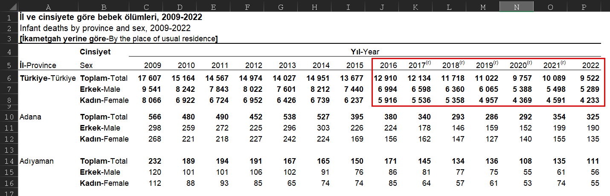

# Processes

1. Select dataset

The selected data set was the following:

2. Convert it into javascript object format
   const data = [
   [2016, 2017, 2018, 2019, 2020, 2021, 2022],
   [12910, 12134, 11718, 11022, 9757, 10089, 9522],
   [6994, 6598, 6360, 6065, 5388, 5498, 5289],
   [5916, 5536, 5358, 4957, 4369, 4591, 4233],
   ];

3. Look into how to programmatically create svg elements

4.
